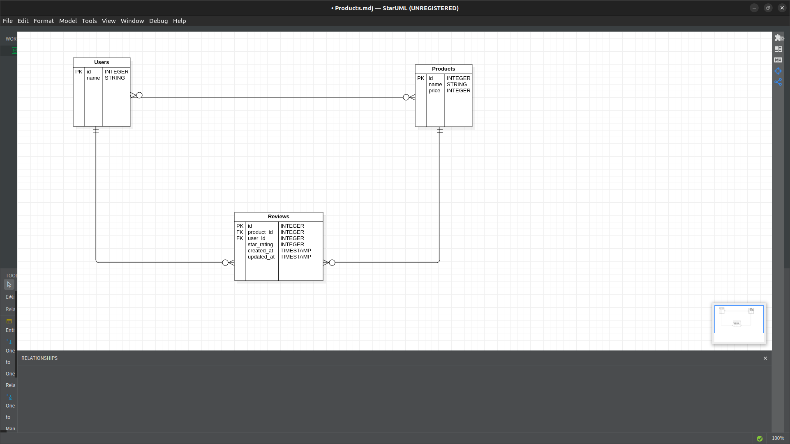

# Project Title
Week 2 Code Challenge: Product Review

### Author : Name Date
Catherine Renee Mumbi 28/02/2023

## Project Description  
This project works with  an e-commerce domain. It has three models: User, Review and Product. 

A product has many Users, a User has many Products and a Review belongs to a User and to a Product.

Product - User is a many to many relationship.

Here is an ERD diagram to express this relationship:

## Project Setup

Fork and clone this repository to your local machine

Navigate to the project directory in your terminal and open the project with the text editor of your choice.

Open the terminal and run bundle install to install the app's dependencies.

The app has 3 models structured in the files: product.rb, review.rb and user.rb. 

To test out your instances run the command `bundle exec rake console` to enter into the rake console. 

Then type out the test case you wish to run, for example:

User.first.products will return the first user's products.

Review.first.user will return the user for the first review.

User.all will return all the users.

Product.all will return all the products.

Review.all will return all the reviews.

Feel free to write some test cases of your own.

 
## Technologies Used
1.Ruby
2.Active Record
3.Bundler 
4.Git
5.Star UML
*****

## Contact Information
* 1723renee@gmail.com
*****

